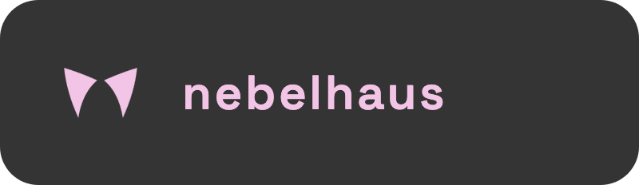
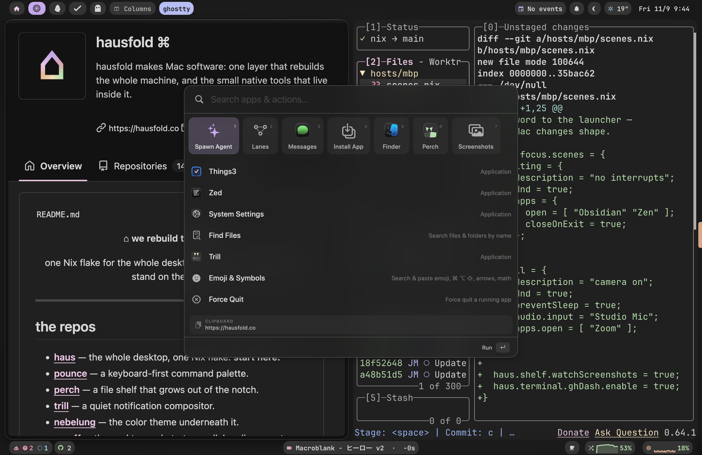

<div align="center">

<!-- identity banner — pink-on-gray wordmark (assets/nebelhaus-banner-gray-bg-rounded.png) -->


**an opinionated macOS, raised in the fog**

the house — the whole rice, one Nix flake. start here.


<!-- assets/hero.png — the whole desktop: Sill bar, Prowl tiling, Pounce open, Nebelung everywhere -->


</div>

---

macOS, arranged like a tiling Linux rig but native to the grain of the Mac — one
Nix flake raises the whole house. Fog-grey, quiet, and reproducible: wipe the
machine, run one command, and the house stands again exactly as it was.

> [!TIP]
> Think *omarchy*, but for macOS instead of Arch.

📖 **Full docs & guides: [nebelhaus.com](https://nebelhaus.com)** — start with
[Install](https://nebelhaus.com/start/install/) and
[First run](https://nebelhaus.com/start/first-run/).

## raise the whole house

```sh
curl -fsSL https://nebelhaus.com/init.sh | bash
# or straight from the flake, once nix is installed:
nix run github:nebelhaus/nebelhaus#bootstrap
```

It installs the prerequisites (Xcode CLT, Determinate Nix), then scaffolds a
**thin config of your own** at `~/.config/nix` — a ~18-line flake that consumes
this repo as an input, plus one host file for the personal bits. You never edit
this repo to use it; your machine stays yours, the rice stays upstream, and `nix
flake update nebelhaus` pulls new fog whenever you like.

It won't switch a config that isn't yours — personalize the generated host file
first, then rebuild.

## the taste

That first switch puts **`haus`** on your PATH, so you never type the
incantation again:

```sh
haus rebuild        # build + switch this machine
haus update         # pull the latest rice, then rebuild
haus rollback       # go back a generation (haus generations lists them)
haus status         # current generation + how old your pinned rice is
haus doctor         # check Nix, the CLT, the GUI agents, and Homebrew cask drift
haus tour           # a guided lap of the four moves, right in the bar
```

On a fresh machine the bar shows a small "new here?" paw — click it and **haus
tour** walks you through the four moves (launch, navigate, resize, palette) live,
advancing as it detects each one. Right-click hides it forever.

## the rooms

The house is built from composable nix-darwin modules. Take the whole thing, or
[import one room](docs/modules.md) into your own config.

- 🛖 **den** — the foundation — macOS defaults (dock/finder/trackpad/keyboard), the Homebrew framework + tap-trust, core CLI tools, fonts, weekly GC
- 🐈 **prowl** — opinionated [AeroSpace](https://github.com/nikitabobko/AeroSpace) tiling, launched via launchd (survives cold boot), Caps→F18 leader, wake-time window re-sort
- 🪟 **sill** — a [SketchyBar](https://github.com/FelixKratz/SketchyBar) setup perched on the top edge, with stray-agent eviction
- 🔥 **hearth** — the terminal — zsh, a Nebelung-tinted starship prompt, git, helix, and a themed toolbelt (bat, delta, lazygit, lsd, yazi, zoxide, fzf), plus the ghostty / zellij / yazi dotfiles
- 🔖 **collar** — identity & auth — Touch ID for sudo (with `reattach`, so it works inside tmux/zellij)
- 🗝️ **secrets** — declarative secrets via [secretspec](https://secretspec.dev) — projects commit *which* secrets they need, never values; values live in the provider you pick per host
- 🐾 **pounce** — the [Pounce](https://github.com/nebelhaus/pounce) palette, wired in as a self-signing daemon that holds its Accessibility grant across rebuilds, and ⌘Space freed for it
- 🐦 **trill** — the [Trill](https://github.com/nebelhaus/trill) Messages client, installed through Nix and copied to a fixed `/Applications/Trill.app`
- 🪺 **perch** — the [Perch](https://github.com/nebelhaus/perch) notch file shelf, same deal (`nebelhaus.perch.enable`)
- 🤫 **hush** — a one-switch Focus/DND: a declarative global hotkey, plus optional Slack status and shell hooks
- 🎨 **theme** — the desktop wallpaper and an accent-derived bold wordmark

## identity is the only thing that's yours

nebelhaus ships everything — system *and* shell. The only blanks are the bits
personal to you: git name/email/signing key, the pounce signing identity, your
secrets, and your private app list. All of it lives in
`hosts/<hostname>/default.nix`, so the rice is complete out of the box and you
layer *you* on top. [Making it
yours](https://nebelhaus.com/guides/making-it-yours/) is the cookbook.

## ask an agent to change it

A declarative machine is the one kind an agent can safely reconfigure: `haus
rebuild` builds before it switches, so a bad edit never reaches the running
system, and `haus rollback` undoes an applied one atomically. What was missing
was knowledge — left to guess, a model reaches for `brew install` and dotfiles
the next rebuild overwrites, or invents an option that doesn't exist.

So the rice ships it. `nebelhaus.claude.skill` (on by default) installs a Claude
Code skill at `~/.claude/skills/nebelhaus` whose option reference is **generated
from the revision you're pinned to** — it can only ever describe options you
actually have, and `haus update` refreshes it with the rice. "Install Slack" or
"make everything bigger" becomes an edit to your host file, applied and
verifiable. `haus doctor` reports whether it's installed.

## more

- [Modules](docs/modules.md) — stealing one room, `mkNebelhaus`, and the identity knobs
- [Adding apps](https://nebelhaus.com/guides/adding-apps/) · [Window management](https://nebelhaus.com/guides/window-management/) · [Moving to a new Mac](https://nebelhaus.com/guides/new-mac/) · [Keeping in sync](https://nebelhaus.com/guides/staying-in-sync/)
- [Coding agents](https://nebelhaus.com/guides/claude-agents/) — `wt`, the worktree tool this rice puts on your PATH, for Claude Code, Codex or OpenCode
- [`CLAUDE.md`](./CLAUDE.md) — hacking on the house, including `zscratch`

## the family

- 🏠 [**nebelhaus**](https://github.com/nebelhaus/nebelhaus) — the house. the whole rice, one Nix flake. start here. *(you are here)*
- 🐾 [**pounce**](https://github.com/nebelhaus/pounce) — the palette. keyboard-first launcher; every command a file.
- 🐦 [**trill**](https://github.com/nebelhaus/trill) — the messages. native iMessage/SMS/RCS, read from `chat.db`.
- 🪺 [**perch**](https://github.com/nebelhaus/perch) — the shelf. files, caught in the notch.
- 🌫️ [**nebelung**](https://github.com/nebelhaus/nebelung) — the theme. the silver-mist palette.
- 🧰 [**workshop**](https://github.com/nebelhaus/workshop) — the bench. where the family is built.

Each one stands alone. Together they're a house.

## the fog

Grey is the point. Nebelung is a low-contrast, muted palette for people who find
Mocha too loud — a cat breed the colour of high fog, hence the name.

## license

MIT · built on [Nix](https://nixos.org),
[nix-darwin](https://github.com/LnL7/nix-darwin),
[home-manager](https://github.com/nix-community/home-manager),
[AeroSpace](https://github.com/nikitabobko/AeroSpace),
[SketchyBar](https://github.com/FelixKratz/SketchyBar), and
[Catppuccin](https://github.com/catppuccin).
